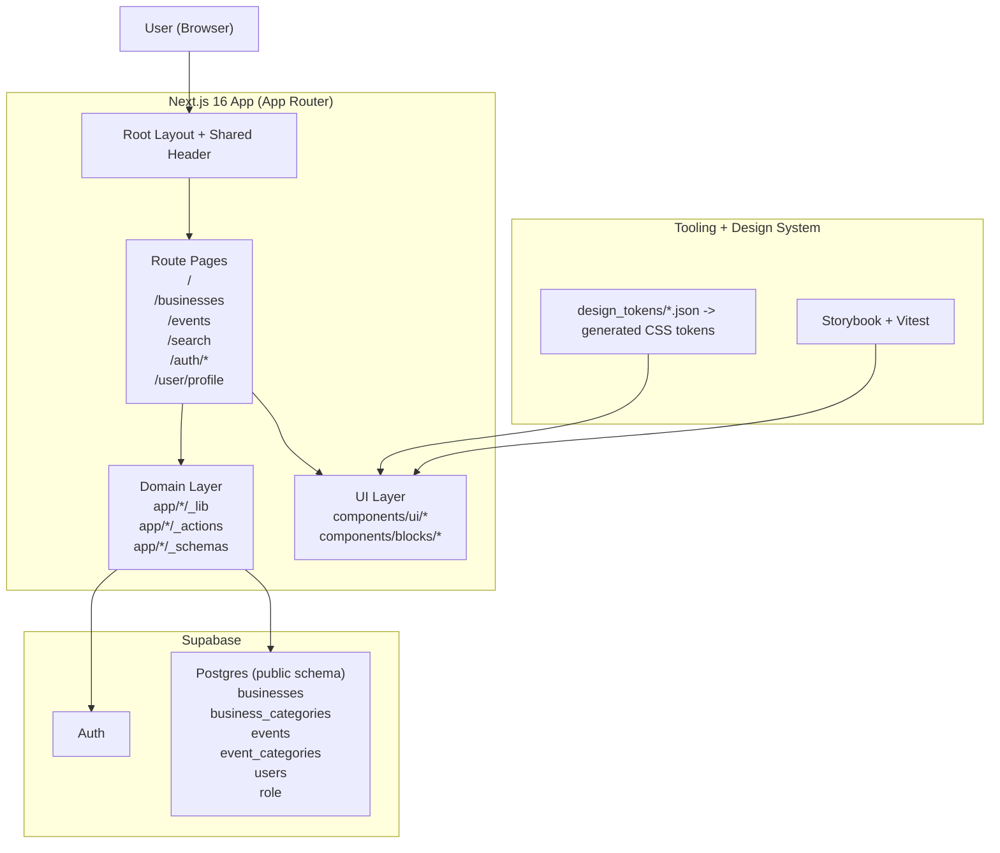

# Smalls London - Project Overview

A curated directory of small creative businesses and events in London.

---

## Table of Contents

- [How to Use This Doc](#how-to-use-this-doc)
- [Source of Truth and Precedence](#source-of-truth-and-precedence)
- [Product Summary](#product-summary)
- [Primary User Flows](#primary-user-flows)
- [Current Feature Set](#current-feature-set)
- [Technical Architecture](#technical-architecture)
- [Data Model (Supabase)](#data-model-supabase)
- [Routing Map](#routing-map)
- [Codebase Structure](#codebase-structure)
- [Design System and UI Rules](#design-system-and-ui-rules)
- [Environment and Scripts](#environment-and-scripts)
- [Current Limitations](#current-limitations)
- [Where to Change What](#where-to-change-what)
- [Delivery Notes](#delivery-notes)

---

## How to Use This Doc

Use this file as high-level implementation context when working in the repository.

- For product requirements and constraints, read `docs/PRD.md`.
- For coding constraints and design-token usage, read `.cursor/rules/design-system-rules.mdc`.
- For Figma-to-code expectations and DS mapping, read `.cursor/rules/figma-design-system.mdc`.
- For project-level agent constraints, read `AGENTS.md`.

This file is intentionally practical: it should explain what exists in the codebase today and how to work with it safely.

---

## Source of Truth and Precedence

When guidance conflicts, follow this order:

1. Runtime code in `src/*` and current generated artifacts (for example `src/services/supabase/types/database.ts`, `src/styles/tokens.css`).
2. Rule files in `.cursor/rules/*` and `AGENTS.md`.
3. Product and context docs in `docs/*` and `context/*`.

Notes:

- `src/services/supabase/types/database.ts` is generated output from Supabase schema types.
- `src/styles/tokens.css` is generated from token sources (`design_tokens/*.json`) via scripts.

---

## Product Summary

Smalls London is a curated, visually opinionated directory experience that helps users discover creative small businesses in London, with supporting event surfaces.

Current product direction in code:

- Public browsing for businesses.
- Category-based discovery.
- Search routes.
- Authentication and account flows via Supabase Auth.
- User profile editing.
- Submission and add flows for businesses.
- Early/placeholder event listing and category routes.

---

## 🎯 Problem Statement

It is hard to find quality local creative businesses.

**The Result:** Consume from established or non-local brands.

**The Solution:** Smalls London provides a curated directory of creative businesses based in London.

---

## 👥 Target Users

| User Type | Primary Needs |
| **London Resident / Local Buyer** | Discover trustworthy, high-quality small creative businesses nearby |
| **Creative Business Owner** | Submit and maintain a profile to reach local customers |
| **Curator / Admin** | Review submissions and keep listings/events high quality and current |
| **Community Explorer** | Browse events and category pages to find new local experiences |

---

## ✨ Features

### Discovery and Browsing

- Curated business directory with a dedicated listing page (`/businesses`).
- Category-based exploration for businesses (`/businesses/category/[category]`).
- Search entry and results routes (`/search`, `/search/[searchString]`).
- Homepage hero and navigation surfaces optimized for exploration.

### Authentication and Account

- Email/password sign-up and login flows.
- Password reset and update flows.
- Auth callback/confirmation handling under `/auth/confirm`.
- User profile page for account detail updates (`/user/profile`).

### Business Contribution Flows

- Business submission experience (`/businesses/submit`).
- Add-business route used for direct creation (`/businesses/add`).
- Form/action/schema setup for validated business data handling.
- User-linked ownership model for submitted/created businesses.

### Events Surface (Current State)

- Events route available at `/events`.
- Category route available at `/events/category/[category]`.
- Events UX/data integration is present and evolving.

---

## 🗂️ Architecture Diagram



---

## 🖱️ Micro-interactions

- **Transitions** - Smooth 150-200ms easing
- **Hover States** - Subtle elevation on cards
- **Toast Notifications** - For CRUD actions
- **Loading States** - Skeleton placeholders
- **Drawer Animations** - Slide-in for item editing

---

## Primary User Flows

### 1) Discover businesses

- Open home page (`/`) and navigate via header/search.
- Browse all businesses (`/businesses`).
- Filter by category (`/businesses/category/[category]`).
- Search via search routes (`/search` and `/search/[searchString]`).

### 2) Manage account

- Sign up, login, reset/update password through `/auth/*`.
- View/update profile at `/user/profile`.

### 3) Submit or add businesses

- Submit flow: `/businesses/submit`.
- Add flow: `/businesses/add` (used for direct creation flow in-app).

### 4) Browse events (in progress)

- Events list route exists at `/events`.
- Events category route exists at `/events/category/[category]`.
- Current implementation is present but not fully fleshed out.

---

## Current Feature Set

### Authentication

- Email/password sign up and login.
- Password recovery and password update.
- Auth confirm callback route (`/auth/confirm`).
- Error/success auth pages.

### Business directory

- Business listing page.
- Category-filtered listing.
- Server-side data retrieval utilities for businesses.
- Form/action/schema setup for business CRUD-like flows.

### User profile

- User profile route and form component.
- Reads/writes against Supabase-backed user table.

### UI and content surfaces

- Reusable header and footer blocks.
- Hero section on homepage.
- Storybook coverage for multiple UI primitives/blocks.
- Component tests in key UI/header modules.

---

## Technical Architecture

### Stack

- Framework: Next.js 16 (App Router, Server Components).
- Language: TypeScript (strict mode expected).
- UI: Tailwind CSS v4 + custom token system + Radix primitives.
- Backend services: Supabase (Auth + Postgres + typed schema generation).
- Validation: Zod.
- Testing: Vitest + Testing Library.
- Component workshop: Storybook 10.

### Rendering and data access

- App Router pages include async server components for route-level data fetching.
- Supabase is consumed via dedicated service helpers:
  - `src/services/supabase/server.ts`
  - `src/services/supabase/client.ts`
  - `src/services/supabase/proxy.ts`
- Domain-level fetch logic is grouped near route domains (for example `src/app/businesses/_lib/*`).

### Styling system

- Global styles in `src/styles/globals.css`.
- Theme/token files in `src/styles/tailwind-theme.css`, `src/styles/tokens.css`.
- Token generation workflow from `design_tokens/*.json` via scripts.

---

## Data Model (Supabase)

Generated DB types indicate the following public tables are currently in use:

- `business_categories`: id, name, label.
- `businesses`: core business directory entity (name, description, category, contact/location metadata, owner).
- `event_categories`: id, name, label.
- `events`: event records (name, location, date).
- `users`: profile details (email, full_name, phone, role).
- `role`: role mapping for users.

Notable relationships:

- `businesses.category` references `business_categories.name`.
- `users.role` references `role.name`.

Type source:

- `src/services/supabase/types/database.ts` (generated).

---

## Routing Map

Top-level route groups currently visible in `src/app`:

- `/` - homepage (hero-driven landing).
- `/auth/*` - login/signup/password flows and callbacks.
- `/businesses` - list, category routes, submit/add flows, business internals.
- `/events` - events listing and category route.
- `/search` and `/search/[searchString]` - search experience.
- `/user/profile` - profile management.

Core layout:

- Root layout (`src/app/layout.tsx`) sets metadata, loads local fonts, applies global styles, and renders shared header.

---

## Codebase Structure

High-level structure relevant for day-to-day implementation:

- `src/app/*`
  - App Router pages, route handlers, domain actions/libs/schemas/components colocated by feature.
- `src/components/ui/*`
  - UI primitives and design-system-level components.
- `src/components/blocks/*`
  - Larger presentational blocks (header/footer/hero).
- `src/services/supabase/*`
  - Supabase clients and generated types.
- `src/styles/*`
  - Global styling, theme, and token outputs.
- `docs/*`
  - Product and design-system requirements.
- `context/*`
  - Working context docs (this file included).

---

## Design System and UI Rules

The project is running a token-driven UI workflow for deterministic implementation and AI generation consistency.

Required practices:

- Use semantic token classes and existing utility mappings.
- Avoid arbitrary values when token or utility equivalents exist.
- Prefer existing components in `src/components/ui/*` and `src/components/blocks/*` over one-off variants.
- Keep Tailwind usage aligned with `.cursor/rules/design-system-rules.mdc`.
- Follow Figma implementation expectations in `.cursor/rules/figma-design-system.mdc` when translating designs.

---

## Environment and Scripts

### Environment variables

At minimum for local app runtime:

- `NEXT_PUBLIC_SUPABASE_URL`
- `NEXT_PUBLIC_SUPABASE_PUBLISHABLE_KEY`

Additional service variables may exist depending on local integrations.

### Useful scripts

```bash
npm run dev              # Next.js dev server
npm run build            # production build
npm run start            # start production server
npm run lint             # ESLint
npm run test             # Vitest
npm run test-ui          # Vitest UI
npm run storybook        # Storybook dev server
npm run build-storybook  # Storybook static build
npm run gen-schemas      # generate Supabase public schema types
npm run gen-types        # generate Supabase DB types file
npm run design-tokens    # regenerate and format CSS tokens
```

---

## Current Limitations

- Events routes exist but feature depth is still lighter than businesses.
- Search and curation quality are functional but still evolving with product direction.
- Auth and profile flows are implemented; role-based admin workflows are still being matured.
- Documentation quality depends on keeping generated artifacts and context docs in sync.

---

## Where to Change What

- **Route pages and route-level logic**: `src/app/*`
- **Business domain libs/actions/schemas/components**: `src/app/businesses/*`
- **Auth pages and auth components**: `src/app/auth/*`
- **User profile UI and logic**: `src/app/user/*`
- **Shared UI primitives**: `src/components/ui/*`
- **Large page blocks (header/footer/hero)**: `src/components/blocks/*`
- **Supabase clients and generated DB types**: `src/services/supabase/*`
- **Global theme/tokens/styles**: `src/styles/*`
- **Product requirements and constraints**: `docs/PRD.md`
- **AI/coding/design rules**: `.cursor/rules/*` and `AGENTS.md`

---

## Delivery Notes

- Keep this document updated when routes, data model, or architectural decisions change.
- Keep detailed acceptance criteria and milestone planning in `docs/PRD.md`.
- Keep implementation-specific constraints in `.cursor/rules/*` and `AGENTS.md`.

---

_Last updated: April 2026_
